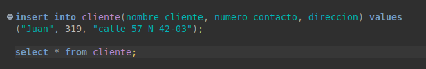
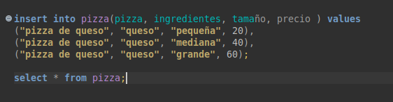
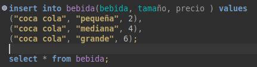
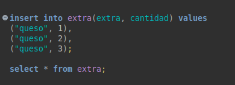
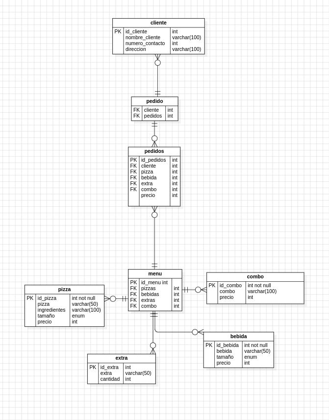

# examen_mysql1

El proyecto trata de crear una base de datos para una pizzeria, debemos manejar clientes, pedidos de pizzas y bebidas, los ingredientes de cada pizza, los tamaños y los precios por tamaño por producto, y los pagos.

Entonces para empezar creamos un nuevo script de sql en dbeaver y luego creamos la database:

create database if not  exists Pizza_fiesta;

al finalizar de crear todas las tablas y agregar los datos, se hacen las consultas

1. **Registrar un nuevo cliente:**

insertamos a la tabla cliente un nuevo cliente usando insert into, agregaremos el nombre de la tabla y los datos que queremos agregar como el nombre del cliente, el numero de contacto y su direccion, luego ponemos el values y dentro de parentesis agregamos los valores en el mismo orden antes colocado y agregamos un ; al finalizar, el selecto * from cliente; es para verificar que el cliente se registro con éxito.

2. **Agregar un nuevo producto (pizza) al menú:**

es igual que el pasado, insert into ya que vamos a agregar informacion a una tabla, luego colocamos la tabla, entre () los datos que queremos agregar, luego colocamos values y entre otros () agregamos los valores que seran agregados, en el mismo orden que los pusimos la primera vez como se ve en la imagen, el select * from pizza; es para verificar que se registro con éxito la pizza

3. **Registrar una bebida en el menú:**

colocamos insert into ya que vamos a agregar informacion a una tabla, luego colocamos la tabla, entre () los datos que queremos agregar, luego colocamos values y entre otros () agregamos los valores que seran agregados, en el mismo orden que los pusimos la primera vez como se ve en la imagen, el select * from bebida; es para verificar que se registro con éxito la bebida

4. **Agregar un ingrediente a la base de datos:**

es similar a la solucion pasada, sin embargo la tabla y los datos a agregar cambian

